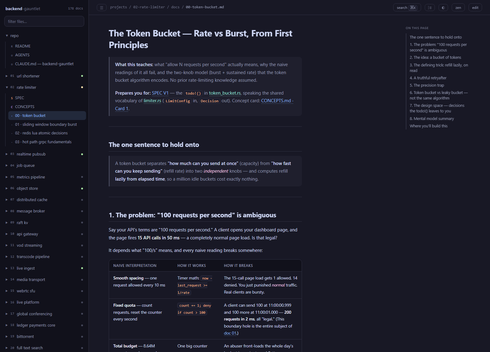
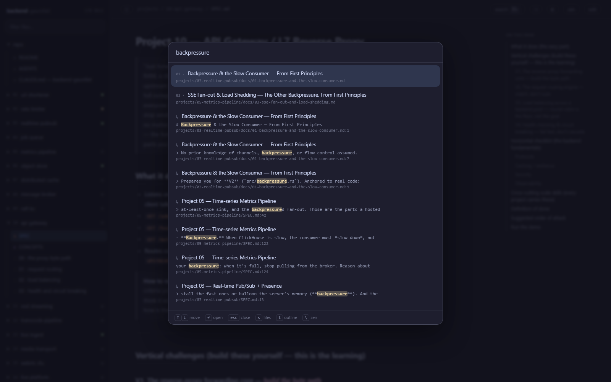
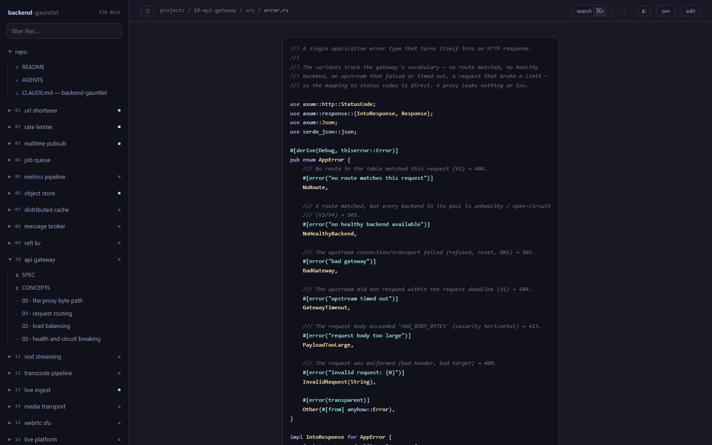
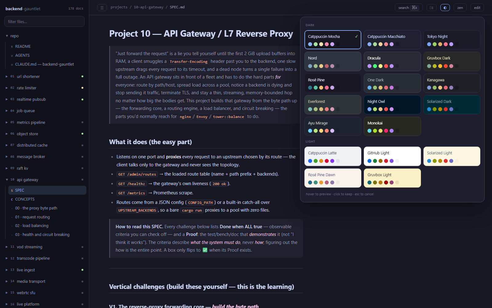

# 📖 tome

**Read any repo's markdown in a browser tab.** One Python file, zero dependencies,
no build step, no network.

```bash
cd ~/work/some-repo
tome --open
```



That's it. `tome` finds the repo root, discovers every `.md` under it, groups them
the way the repo is actually laid out, and serves a fast reader on `127.0.0.1`.
Edit a doc in your editor and the page re-renders in place, keeping your scroll
position.

It exists because reading docs *inside* the editor is bad — you lose the split you
were coding in, the rendering is mediocre, and cross-doc links go nowhere. Docs
belong in the other window.

---

## What it looks like

**⌘K searches every doc at once** — fuzzy title matches first, then full-text hits
with the matching line and its line number. Enter jumps you to the match, not just
the page.



**Links into code actually open the code.** A doc that says
`[error.rs](../src/error.rs)` gets you the real file, syntax-highlighted, in the
same reader — no editor round-trip to check whether the doc still matches reality.



**Nineteen themes, hover to preview.** Each swatch is rendered in its own palette,
so what you hover is what you get. The choice follows you into every other repo you
open.



<sub>Screenshots are of <a href="https://github.com/utkarsh5026/backend-gauntlet">backend-gauntlet</a>, a 22-package monorepo — the sidebar grouping and status dots come from its layout, not from configuration.</sub>

---

## Why not just use the GitHub preview / a static site generator?

| | tome | VS Code preview | MkDocs / Docusaurus |
|---|---|---|---|
| Setup | none | none | config, deps, build |
| Sees the *whole* repo | ✅ every `.md`, grouped | one file | only what you wire up |
| Links to source files | ✅ opens `../src/router.rs` highlighted | ❌ | ❌ |
| Full-text search | ✅ ⌘K across all docs | ❌ | ✅ |
| Live reload | ✅ scroll preserved | ✅ | ✅ (slow rebuild) |
| Dependencies | **0** | — | dozens |
| Works offline | ✅ | ✅ | usually |

`tome` is not a documentation *site* generator. It never produces a build
artifact, and it is not for publishing. It's a reader for the docs you already
have, on your machine, right now.

---

## Install

Pick whichever matches how you already install tools.

```bash
# uv — recommended, installs the `tome` command globally
uv tool install tome-docs

# pipx
pipx install tome-docs

# plain pip
pip install tome-docs

# no install at all — run it straight from PyPI
uvx --from tome-docs tome
```

Want the tip of `main` instead of the latest release? Point any of the above
at the repo:

```bash
uv tool install git+https://github.com/utkarsh5026/tome
```

Or, because it really is one file with no imports beyond the standard library:

```bash
curl -o ~/.local/bin/tome https://raw.githubusercontent.com/utkarsh5026/tome/main/tome.py
chmod +x ~/.local/bin/tome
```

Needs Python 3.9+. That's the entire dependency list.

### No Python? Download a binary

Every release also ships a standalone executable with the interpreter baked in —
one file, nothing to install, no Python anywhere on the machine.

**[Grab the latest release →](https://github.com/utkarsh5026/tome/releases/latest)**

| platform | file |
| --- | --- |
| Linux · x86_64 | `tome-linux-x86_64` |
| Linux · ARM64 | `tome-linux-aarch64` |
| macOS · Intel | `tome-macos-x86_64` |
| macOS · Apple Silicon | `tome-macos-arm64` |
| Windows · x86_64 | `tome-windows-x86_64.exe` |

```bash
# macOS / Linux — make it executable and put it on PATH
chmod +x tome-macos-arm64
mv tome-macos-arm64 ~/.local/bin/tome
```

On Windows, double-clicking works too — it serves whatever folder it sits in.

The binaries are unsigned, so the OS will say so the first time: on macOS,
right-click → **Open** once (or `xattr -d com.apple.quarantine tome`); on
Windows, SmartScreen's **More info → Run anyway**. A `SHA256SUMS` file is
attached to every release if you'd rather verify the download.

Worth knowing what you're trading: the binary is ~10 MB against the source's
100 KB, because most of it is Python itself. If you already have an interpreter,
the installs above are the better deal.

### Update

Whichever way you installed it, updating uses the same tool — tome doesn't
phone home or update itself:

```bash
uv tool upgrade tome-docs      # uv
pipx upgrade tome-docs         # pipx
pip install -U tome-docs       # plain pip

# installed from the tip of main
uv tool install --force git+https://github.com/utkarsh5026/tome

# installed via curl
curl -o ~/.local/bin/tome https://raw.githubusercontent.com/utkarsh5026/tome/main/tome.py
```

`tome --version` prints what you currently have.

---

## Use

```bash
tome                      # serve the repo you're standing in
tome --open               # …and open a browser tab
tome --port 9000          # preferred port (auto-advances if taken)
tome README.md            # open straight to a file
tome docs/adr             # …or a directory (opens its README/SPEC)
tome 10                   # …or a numbered package: projects/10-*
tome --root ~/work/api    # serve a repo you're not standing in
```

Run it in several repos at once — the port auto-advances, and each repo
remembers its own reading position independently.

### Keys

| | |
|---|---|
| <kbd>⌘K</kbd> / <kbd>ctrl-K</kbd> | jump to a doc, or type 3+ chars to grep inside all of them |
| <kbd>s</kbd> | show/hide the file sidebar |
| <kbd>t</kbd> | show/hide the page outline |
| <kbd>\\</kbd> | zen mode (hide both, centre the text) |
| <kbd>,</kbd> | theme picker — 19 of them, hover to preview |

---

## What it renders

A focused GFM subset, chosen by looking at what real repo docs actually contain:

- headings with anchor links and a live table of contents
- fenced code with syntax highlighting for **Rust, Python, TypeScript, Go, SQL,
  bash, JSON, TOML, YAML, Dockerfile, Makefile** — hand-rolled, ~60 lines, no Pygments
- GFM tables with alignment, task lists, nested lists, blockquotes
- GitHub alert callouts (`> [!NOTE]`, `> [!WARNING]`, …)
- images, `mermaid` blocks, and a whitelist of inline HTML
- **links that resolve**: `[router.rs](../src/router.rs)` opens the real source
  file, syntax-highlighted, inside the reader. Broken links render in red, so a
  doc that's drifted from the code is visible at a glance.

---

## Configuration

There is none, until you want some. Drop a `.tome.json` at the repo root:

```bash
tome --init-config
```

```json
{
  "title": "backend-gauntlet",
  "icon": "🦀",
  "pinned": ["SPEC", "CONCEPTS", "RESEARCH", "README"],
  "groupDirs": ["projects", "packages", "crates"],
  "skip": ["fixtures", "snapshots"],
  "theme": "tokyo",
  "home": "README.md",
  "editor": "vscode"
}
```

| key | what it does | default |
|---|---|---|
| `title` | name in the tab and sidebar | the repo directory name |
| `icon` | emoji favicon — give each repo its own so a row of tabs is tellable apart | `📖` |
| `pinned` | doc stems pinned to the top of each section, **in this order** | `README, SPEC, DESIGN, ARCHITECTURE, CONCEPTS, RESEARCH, ROADMAP, CHANGELOG, CONTRIBUTING` |
| `groupDirs` | directories whose *children* each get their own section | `projects, packages, apps, crates, services, libs, modules, plugins, examples, cmd, workspaces` |
| `skip` | extra directory names to ignore (added to the defaults) | — |
| `skipOnly` | replace the default ignore list outright | — |
| `theme` | default theme for people who haven't picked one | `mocha` |
| `home` | doc to open on a fresh visit | the root README |
| `editor` | what the **edit** button opens: `vscode`, `cursor`, `zed`, `idea`, `sublime`, `none`, or a `{path}` template | `vscode` |

### How grouping works

Three rules, applied in order:

1. Markdown at the repo root becomes one **repo** section.
2. A directory listed in `groupDirs` contributes **one section per child** — so
   `projects/10-api-gateway/` becomes its own section, labelled `10 · api gateway`.
   This is the monorepo case.
3. Every other top-level directory is a single section.

A leading `NN-` on a package name is pulled out and shown as its number, which is
also what makes `tome 10` work.

### Status dots

Optional, and inert if you don't use it. If a section's `SPEC.md`, `STATUS.md`, or
`README.md` opens with a render-invisible status block, the sidebar shows a
coloured dot for it:

```html
<!-- status:
state: active            # active | paused | blocked | done | not-started
-->
```

---

## Notes on the design

- **One file, standard library only.** Not a constraint for its own sake: it means
  `tome` installs in one second, runs on any machine with Python, and can be
  vendored into a repo by copying a single file. The markdown parser, the syntax
  highlighter, and the HTTP server are all in there and all deliberately small.
- **The markdown parser is not CommonMark** and doesn't try to be. It handles what
  repo docs use. When it meets something it doesn't know, it degrades to a
  paragraph rather than mangling the page.
- **The syntax highlighter is a tokenizer, not a parser.** Good enough to read at
  a glance; it will get an edge case wrong and that's an accepted trade.
- **Loopback only.** It serves file contents out of your repo. It binds
  `127.0.0.1` and refuses to serve `.env` files, private keys, `.netrc`, and
  friends — but it is a local reader, not a server to expose.
- **Preferences are global, position is per-repo.** Your theme follows you across
  every repo; "the doc I was last reading" doesn't.

## License

MIT © Utkarsh Priyadarshi
