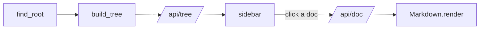

# Markdown Tour

This doc exists to give `tome` something real to render. It walks through the
markdown shapes the parser supports — open it in the reader (`python3 tome.py`)
and check each section actually looks right.

## Headings & emphasis

Every `##`/`###` heading here shows up in the right-hand table of contents.
Inline styles: **bold**, *italic*, ***bold italic***, ~~strikethrough~~, and
`inline code`. A bare URL autolinks too: https://github.com/utkarsh5026/tome.

## Callouts

> [!NOTE]
> A plain blockquote, or one tagged `[!NOTE]`, renders as a note callout.

> [!TIP]
> `[!TIP]`, `[!WARNING]`, `[!IMPORTANT]`, and `[!CAUTION]` each get their own
> color in the sidebar's alert styling.

> [!WARNING]
> Nothing here is fetched over the network — this file is rendered entirely
> by the standard library.

## Lists

Unordered, with nesting:

- discovery walks every document under the repo root
  - skipping `skip_dirs` like `node_modules` and `.git`
  - grouping monorepo packages by their `group_dirs` prefix
- rendering happens in-process, no subprocess, no pip install
- the server binds `127.0.0.1` only

Ordered:

1. `find_root` walks up from the cwd looking for `.git` or `.tome.json`
2. `build_tree` walks down from there, grouping what it finds
3. the browser asks `/api/tree` and `/api/doc` for the rest

Task list, including the SPEC convention's in-progress mark:

- [x] parse GFM tables
- [x] syntax-highlight fenced code
- [~] chase down every markdown edge case a real repo throws at it
- [ ] grow a CommonMark test suite (deliberately not a goal — see `CLAUDE.md`)

## Table

| Feature          | Supported | Notes                                |
| ---------------- | :-------: | ------------------------------------ |
| Tables           |    ✅     | GFM subset, with alignment           |
| Task lists       |    ✅     | `[ ]`, `[x]`, and SPEC's `[~]`       |
| Fenced code      |    ✅     | see [the highlighting tour](02-code-highlighting.md) |
| Footnotes        |    ❌     | not something repo docs actually use |
| Right-aligned    |    ✅     |                              42 rows |

## Links & images

- [`tome.py`](../tome.py) — the whole program, one file, read top to bottom.
- [`test_tome.py`](../test_tome.py) — the test suite this doc set should not break.
- [Code highlighting tour](02-code-highlighting.md) — a doc-to-doc link.
- [Straight to a heading](#lists) — an in-page anchor.
- [A link to nowhere](./does-not-exist.md) — left in on purpose, to show how
  a missing target still renders instead of breaking the page.
- 

---

That horizontal rule above is three dashes on their own line. Below it: a
tiny mermaid diagram, rendered client-side and lazily, only if the browser
asks for it.

